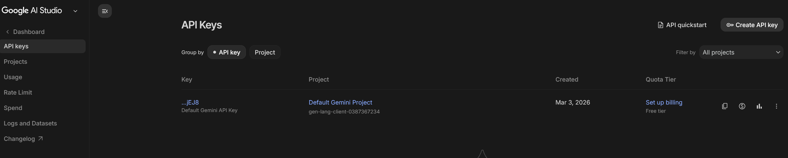
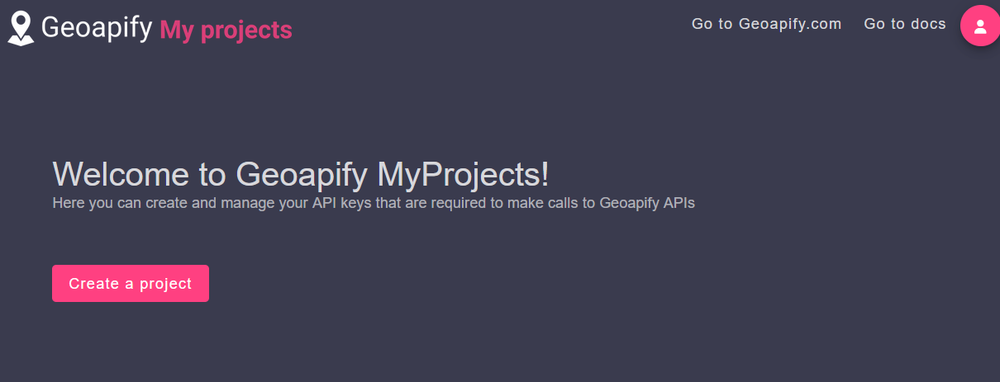
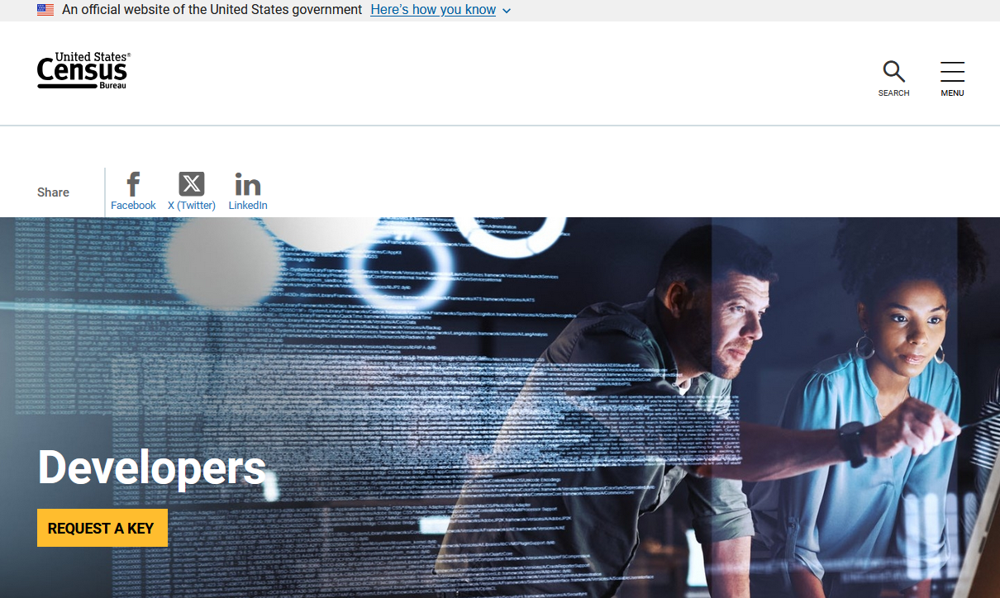

# Geo-Intelligence Application

Full-stack geo-intelligence app with:

- `frontend` - Next.js UI for chat, maps, and demographics views
- `backend/agent` - LangGraph-based orchestration and tool planning
- `backend/mcp_server` - FastAPI data service over Geoapify, Census, and Overpass

## Architecture

`frontend (3000)` -> `agent API (8002)` -> `mcp_server (8101)` -> external providers

The agent decides which tools to call, then the MCP server executes provider requests and returns normalized payloads.

## Quick Start

### Prerequisites

- Node.js 20+
- Python 3.11+

### 1) Create virtual environments and install dependencies

```bash
# MCP server
cd backend/mcp_server
python -m venv .venv
# Windows (Git Bash)
source .venv/Scripts/activate
# macOS/Linux
# source .venv/bin/activate
pip install -r requirements.txt

# Agent server
cd ../agent
python -m venv .venv
# Windows (Git Bash)
source .venv/Scripts/activate
# macOS/Linux
# source .venv/bin/activate
pip install -r requirements.txt

# Frontend
cd ../../frontend
npm install
```

### 2) Configure environment variables

Create/update `.env` files for each service:

- `backend/mcp_server/.env` (Geoapify, Census, Overpass settings)
- `backend/agent/.env` (LLM + MCP base URL)
- `frontend/.env.local` (agent API base URL and map key)

### API Key Setup

#### Gemini API key (for agent LLM)

1. Go to `https://aistudio.google.com/api-keys`.
2. Sign in at AI Studio and create/copy your API key (free tier is fine for testing).
3. In this project, use Gemini with these `backend/agent/.env` values:
   - `AGENT_LLM_PROVIDER=google`
   - `AGENT_LLM_MODEL=gemini-2.5-flash` (recommended) or `gemini-2.5-flash-lite`
   - `AGENT_LLM_API_KEY=<your Google AI Studio key>`
4. Note: free-tier request limits can be low (for example, around 20 requests/day depending on account/model limits).



#### Geoapify API key (places/maps)

1. Sign up at `https://www.geoapify.com/`.
2. Open `https://myprojects.geoapify.com/projects`.
3. Click **Create Project**, name it, and copy the generated API key.
4. Set this key in:
   - `backend/mcp_server/.env` as `MCP_GEOAPIFY__API_KEY`
   - `frontend/.env.local` as `NEXT_PUBLIC_GEOAPIFY_STATIC_KEY` (if using static map URLs)



#### Census API key (demographics)

1. Go to `https://www.census.gov/data/developers.html`.
2. Click **Request a Key**.
3. Enter email + organization name (for testing, `independent` is fine).
4. Submit, then open the activation email and activate your key.
5. Wait a few minutes after activation.
6. Set key in `backend/mcp_server/.env` as `MCP_CENSUS__API_KEY`.



### 3) Run services

```bash
# terminal 1
cd backend/mcp_server
# activate venv
source .venv/Scripts/activate
uvicorn app.main:app --port 8101

# terminal 2
cd backend/agent
# activate venv
source .venv/Scripts/activate
uvicorn app.main:app --port 8002

# terminal 3
cd frontend
npm run dev
```

Open `http://localhost:3000`.

## Service Docs

- Agent details: `backend/agent/README.md`
- MCP server details: `backend/mcp_server/README.md`
- Frontend details: `frontend/README.md`

For onboarding and handoff, start with the agent README section **Documentation Philosophy** and **How To Add New Functionality**, since orchestration logic lives primarily in the agent layer.

## Notes

- Some ZIP/location inputs may not be resolvable by providers; the agent now returns a clear fallback message.
- Category mapping uses an agent-owned cache at `backend/agent/app/data/geoapify_categories_cache.json`.
